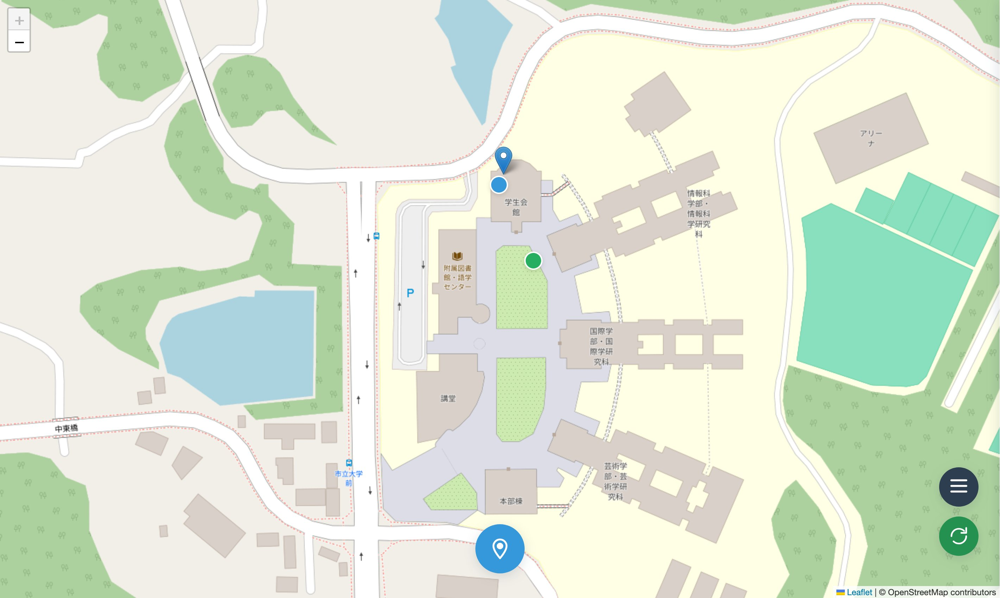
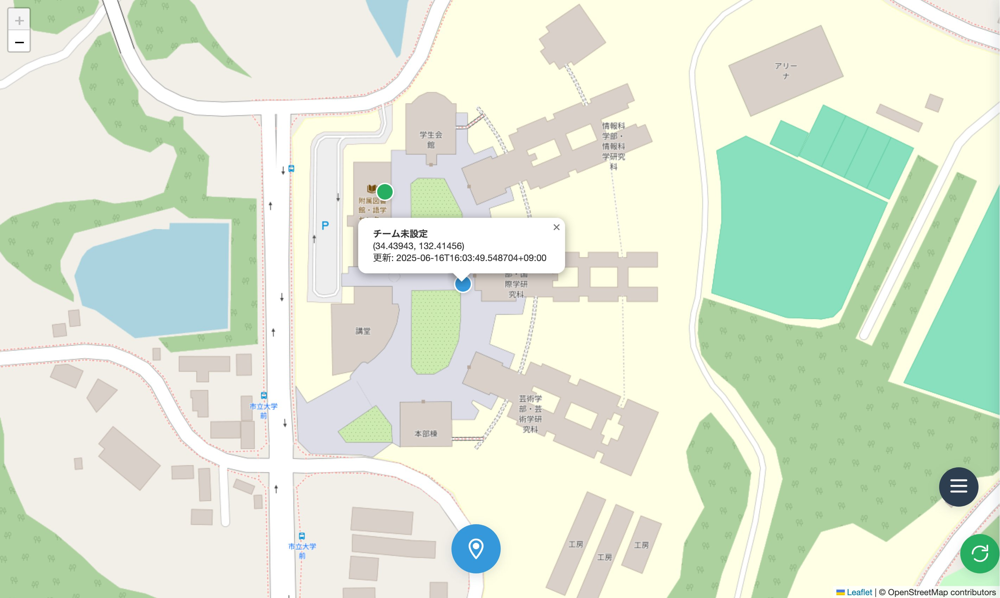
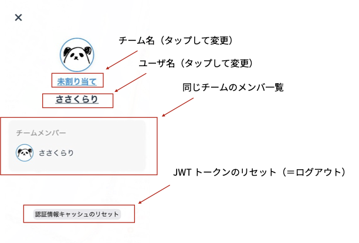
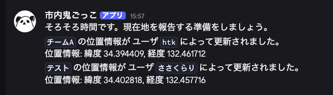

# tenchi-geolocation

市内鬼ごっこ (2025) の位置情報共有ウェブアプリ。

## 市内鬼ごっことは？

市内鬼ごっことは、「[天地創造部](https://www.hiroshima-cu.ac.jp/campuslife/content0110/c00033687/?doing_wp_cron=1750598757.6048951148986816406250)」で伝統的に行われる広島市内を舞台にした鬼ごっこ。

広島市内を公共交通機関を利用して移動しつつ、30分ごとに位置情報を共有しながら、逃げたり追いかけたりする。

## これは何？

市内鬼ごっこ中に位置情報を共有するためのウェブアプリ。それ以外の機能は提供しない。

## 使い方

- 1. アプリを開く
- 2. ドロワーメニューを開く
- 3. ログイン
- 4. 「位置情報の共有」を許可
- 5. 画面下部の中央、青色のボタンをタップ
- 6. 画面右側の緑色のボタンで、他チームの位置情報を更新

## 動作環境

- Google Chrome (iOS / MacOS / Android / Windows)
- Safari (iOS / MacOS)
- firefox (iOS / MacOS / Android / Windows)

## スクリーンショット

### 地図1

自分の位置は青いピン。自チームが登録した最新の位置は青い円。他チームの最新の位置は緑の円で表示される。

### 地図2

ピンや円をタップすると、位置情報の詳細が表示される。

### ドロワーメニュー

いろんなことができる。

## ウェブフック

位置情報を登録するとウェブフックが飛んでくる（Discord）。

